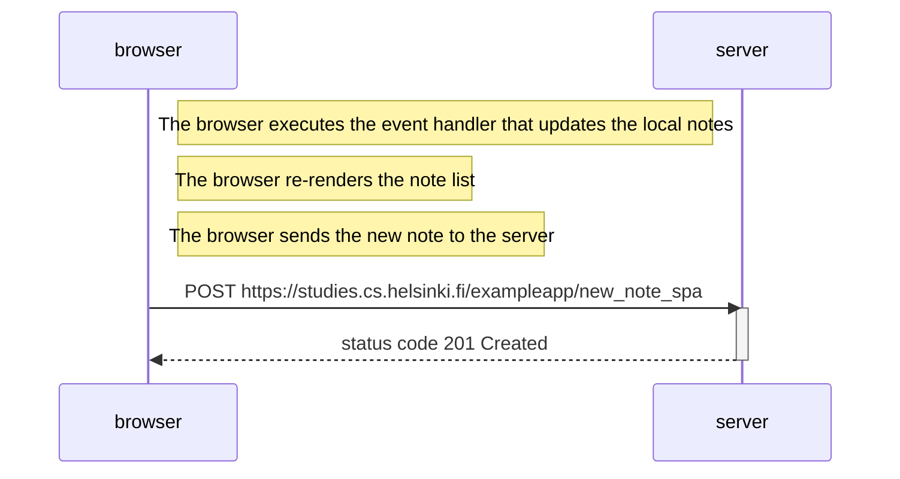

```mermaid
sequenceDiagram
    participant browser
    participant server

    Note right of browser: The browser executes the event handler that updates the local notes
    
    Note right of browser: The browser re-renders the note list
    
    Note right of browser: The browser sends the new note to the server

    browser->>server: POST https://studies.cs.helsinki.fi/exampleapp/new_note_spa
    activate server
    server-->>browser: status code 201 Created
    deactivate server

```